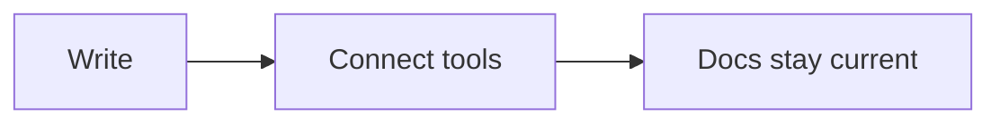

# Falconer formatting

Falconer documents use Markdown plus Falconer-specific references and rich blocks.

## References

Preserve existing Falconer references exactly:

```markdown
![f>][reference-id]
![f>][display text][reference-id]
```

Do not invent new reference IDs. If a reference is needed and no ID exists, write normal text and ask the user or use available Falconer tools to find the referenced content.

## Headings

Falconer supports four heading levels:

```markdown
# Heading 1
## Heading 2
### Heading 3
#### Heading 4
```

## Text styles

Use standard Markdown for bold, italic, strikethrough, links, and inline code:

```markdown
**bold**
*italic*
~~struck through~~
`inline code`
[link](https://falconer.com)
```

Highlights use `mark` tags with Falconer color tokens:

```html
<mark data-color="blue" style="background-color: hsl(var(--editor-color-blue)); color: inherit; padding-top: 2px; padding-bottom: 3px;">highlighted text</mark>
```

Supported highlight colors are red, orange, yellow, green, blue, and purple.

## Lists and tasks

Use GitHub-flavored Markdown for lists and task lists:

```markdown
- Parent item
  - Child item

1. First item
2. Second item

- [x] Finished task
- [ ] Open task
```

## Code

Use fenced code blocks with a language:

```python
def greet(name: str) -> str:
    return f"Hello, {name}!"
```

## Tables

Use GitHub-flavored Markdown tables:

```markdown
| Element | How to insert it | Sortable |
| --- | --- | --- |
| Heading | `## ` | No |
| Table | `/table` | Yes |
```

## Math

Falconer renders LaTeX with KaTeX:

```markdown
Inline math: $E = mc^2$

Centered block:

$$
\int_0^\infty e^{-x}\,dx = 1
$$
```

Some existing documents may use `$$inline math$$` or block math fenced with `$$...$$` or `$$$...$$$`. Preserve existing math delimiters unless changing them is necessary.

## Diagrams

Use Mermaid code blocks for diagrams:



## Falconer rich components

Falconer documents support rich components beyond standard Markdown. Use them when they make a document clearer or more scannable, but don't force them where plain prose works better. Write them with the exact syntax below - they are parsed from the Markdown you emit.

### Callouts

Highlight a note, warning, or critical message. Use GitHub alert syntax. Supported types: `NOTE`, `CAUTION`, `DANGER`.

```markdown
> [!NOTE]
> Useful context the reader should not miss.

> [!CAUTION]
> Something to be careful about.

> [!DANGER]
> A critical warning.
```

### Accordions

Collapsible sections, good for FAQs or optional detail. Wrap multiple accordions in an `<AccordionGroup>`; a single one can stand alone.

```markdown
<AccordionGroup>
<Accordion title="First question">
Answer content in markdown.
</Accordion>
<Accordion title="Second question">
More content.
</Accordion>
</AccordionGroup>
```

### Tabs

Switch between alternative views of related content. Each tab needs a `title`. For grouped code samples, add `data-code-group="true"` to `<Tabs>`.

```markdown
<Tabs>
<Tab title="Overview">
Content for the first tab.
</Tab>
<Tab title="Details">
Content for the second tab.
</Tab>
</Tabs>
```

### Columns

Place content side by side. `cols` is the number of columns (1-12).

```markdown
<Columns cols={2}>
  <Column>
Left column content.
  </Column>
  <Column>
Right column content.
  </Column>
</Columns>
```

### Cards

A styled container, optionally with an icon, link, and call-to-action button. `icon` takes a Tabler icon name; add `horizontal` for a side-by-side layout.

```markdown
<Card icon="rocket" url="https://example.com" cta="Learn more">
Card content in markdown.
</Card>
```

### Steps

Number a sequence of actions, good for tutorials, setup guides, or any ordered procedure. Wrap each step in a `<Step>` with an optional `title`, and wrap the whole sequence in `<Steps>`.

```markdown
<Steps>
<Step title="Install dependencies">

Run the install command and wait for it to finish.

</Step>
<Step title="Configure the project">

Add your settings to the config file.

</Step>
</Steps>
```

All custom components can contain normal markdown block content (paragraphs, lists, code blocks, etc.).

## Media

For local images or videos, call `upload_media` first and insert the returned snippet. Do not guess asset URLs or write local filesystem paths into Falconer documents.

## Divider

Use a horizontal rule for dividers:

```markdown
---
```
